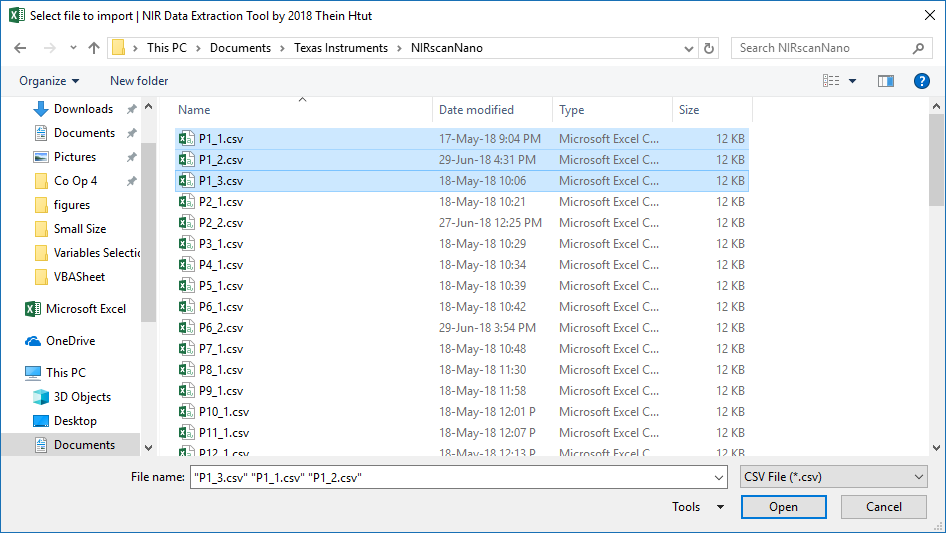
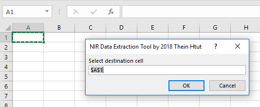
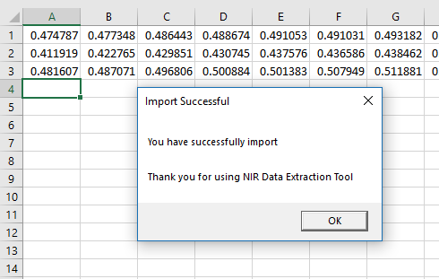

# NIR-Data-Extraction
Near-Infrared (NIR) Data Extraction Tool for Microsoft Excel VBA macro. NIR data are generated as *.csv* files by **DLP® NIRscan™ Nano Evaluation Module** from **Texas Instruments** from scanning. By default, this code will extract the absorbance data from .csv file. You can also modify as desired. See the detail down below

<p align="center">

</p>
> TI DLP® NIRscan™ Nano Evaluation Module


## Getting Started

The reason why I created this simple lines of code is that TI DLP® NIRscan™ Nano Evaluation Module does not come with how to easily copy of the NIRscan data for further spectroscopic analysis. So, I have to manually open each *.csv* file, copy the data **(B23:B250)**, open back my main workbook, paste them in transpose. Imagine you have 1,000 csv files which contain NIR spectrum data.

So, I automated the process in order to save some time and frustrations so that I can focus and spend more time on doing analysis on my NIR spectrum data on MATLAB, The Unscrambler X and other machine learning platform.

Now, Let's get started.


## Importing to Excel

Simple. Open Microsoft Excel --> Developer --> Visual Basis *(Alt+F11)*
In your Microsoft Visual Basic for Application Window, go to:
1. File --> Import File *(Ctrl+M)*
2. *Select /Your File Path/NIR_Data_Extraction_Tool_1.bas* --> Open


## Extracting Data

The real fun starts here. Go to :  
1. Microsoft Excel --> Developer --> Macros *(Alt+F8)*

2. Select --> NIR_Data_Extraction_Tool --> Run  

3. Select --> Your_CSV_Files.csv (Multiple Files Selection Available)  


4. Select your destination cell  



5. Voila! Sit back, wait and let the macros do everything. You will receive a message box after successfully imported.  


### Modifying The Code For NIR Intensity
If you want to change to Reference Signal (unitless), you should find the code and change to C-columns

```
' This data is Absorbance from range B23:B250
userSelectedWb.Sheets(1).Range("C23:C250").Copy
xRng.PasteSpecial Transpose:=True
```

Or if you want to change to Sample Signal (unitless), you should find the code and change to D-columns

```
' This data is Absorbance from range B23:B250
userSelectedWb.Sheets(1).Range("D23:D250").Copy
xRng.PasteSpecial Transpose:=True
```

## Development

Additional features- *Working in progress further updates*

## Built With

* Microsoft Excel Visual Basic Application

## Version

NIR_Data_Extraction_Tool_V1.0

## Authors

* **Thein Htut** - *NIR-Data-Extraction* - [Github](https://github.com/theinhtut)

See also the list of [contributors](https://github.com/theinhtut/NIR-Data-Extraction/graphs/contributors) who participated in this project.

## License

This project is licensed under the MIT License - see the [LICENSE.md](LICENSE.md) file for details

## Acknowledgments

* Brillianda Sheravina - For inspiration by love ❤
* To anyone whose codes were used as reference.
